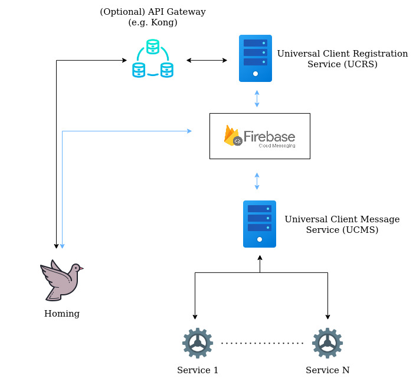
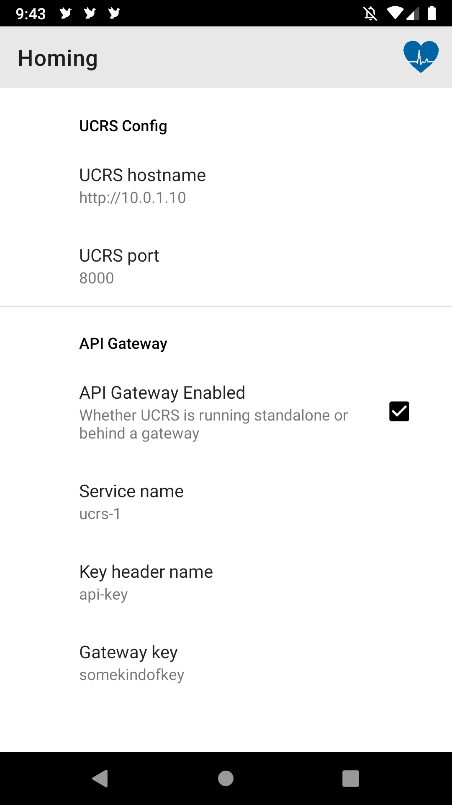
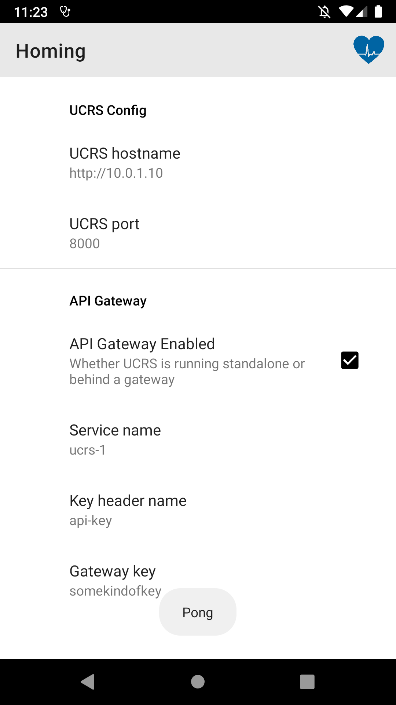
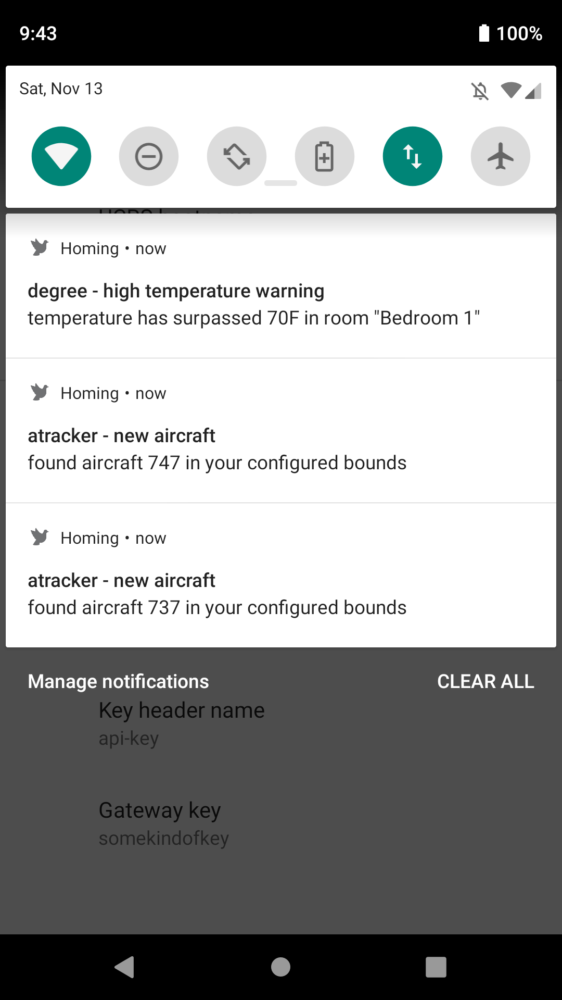
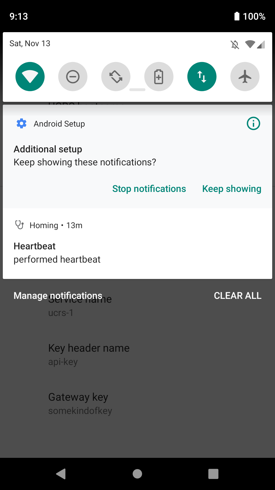

# **Homing**
A push notification client for Android built on Firebase
Cloud Messaging (FCM). Makes it easy to view
notifications that were pushed from multiple services.

## **Architecture**
The architecture behind Homing is as follows:

### **UCMS**
The role of [UCMS](https://github.com/kingcobra2468/ucms) is to serve as a gateway
for various services that want to communicate with Homing. UCMS pushes these notifications
to a FCM pool which Homing is a member of.

### **UCRS**
The role of [UCRS](https://github.com/kingcobra2468/ucrs) is to handle the lifecycle of Homing.
When a new device installs Homing, it will receive a new Firebase registration token. This token
is sent to UCRS which adds it to a predefined FCM pool. Since UCRS unsubscribes inactive devices
from the pool, Homing periodically (around every 12 hours) performs a "heartbeat" to notify UCRS
that the device is alive.

### **Firebase Cloud Messaging (FCM)**
FCM is utilized as the message transport protocol due to its built-in battery saving features.
Since the channel is shared with other Android apps, this removes the need for developing custom
polling/listening services. 

## **Screenshots**
These screenshots show some of the capabilities of Homing.

### **Settings page**
Since Homing is meant to be used as background service, the app solely consists of a single settings screen for
performing initial setup.

  <kbd></kbd>
  <kbd></kbd>

If an API gateway isn't used, then the only configuration that needs to be done is to set the UCRS
hostname and port of the running service. Otherwise, when a API gateway is enabled, the service name
(for Host header routing), and key and key header name (if key-based auth is enabled) needs to be
configured as well. The settings can be tested by clicking on the blue heart button in the toolbar.
This sends a ping-pong alive check which should return "pong" popup if UCRS is reachable.

### **Notifications**
The FCM and heartbeat service will run in the background indefinitely even after the app is removed
from running apps tray.

  <kbd></kbd>
  <kbd></kbd>

As seen in the left screenshot, notifications of various services will be present. Likewise, as seen
in the screenshot to the right, whenever a heartbeat takes place, a popup will appear which will
state whether it was successful or not.

## **Setup**
Setting up Homing requires these steps to be done:
1. Create Firebase project if UCRS and UCMS have not been setup yet. Follow steps
[here](https://firebase.google.com/docs/cloud-messaging/android/client#create_a_firebase_project) on
how to create Firebase project. Otherwise, make sure to use the same project.
2. Generate the `google-services.json` Firebase project config file and put it inside of `app/`  directory.
Info on how to get this file can be found [here](https://firebase.google.com/docs/cloud-messaging/android/client#add_a_firebase_configuration_file).
3. The app can now be built and setup as needed as per UCRS runtime environment.   